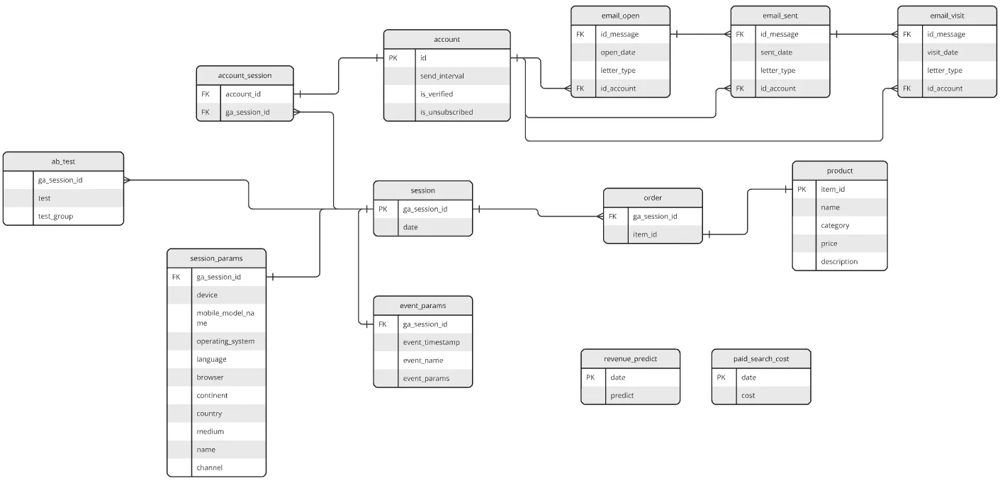
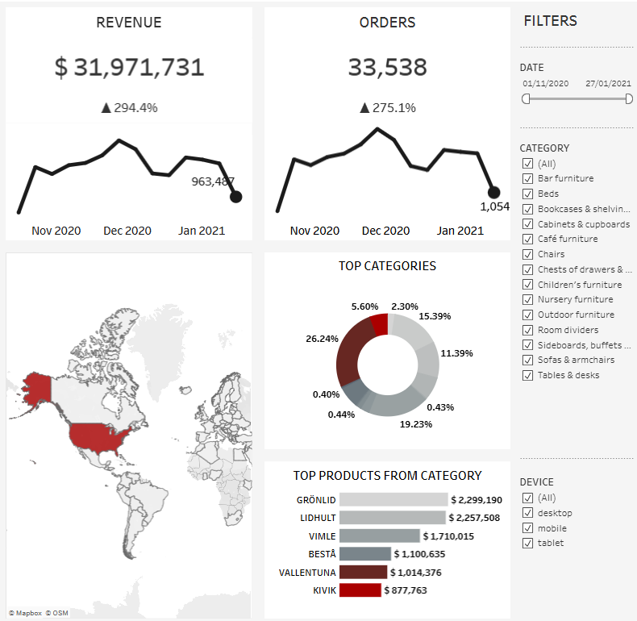

# E-commerce Revenue & Orders Analysis Dashboard

## Project Overview

This project analyzes e-commerce sales data and presents key revenue and order metrics in an interactive Tableau dashboard.
The dataset was extracted from BigQuery by joining order, product, session, and geographic data into an aggregated reporting dataset.

The objective was to:

- Track total revenue and order volume with week-over-week change indicators

- Visualize revenue and order dynamics over time (weekly granularity)

- Analyze geographic revenue distribution across countries

- Identify top-performing product categories and drill down into top products within each category

- Compare performance across device types (desktop, mobile, tablet)

## Tools & Technologies

- SQL (BigQuery)

- Tableau Public

## Database Structure

The analysis is based on four core tables from a relational database:

- `order` – transactional data (session ID, item ID)

- `session` – session ID and date

- `product` – product details (name, category, price)

- `session_params` – session-level attributes (country, device)

### Database Schema



## Data Preparation (SQL Layer)

[View SQL Query](sql/sales_analysis_query.sql)

The reporting dataset was created using a SQL aggregation query that:

- Linked orders to sessions via `ga_session_id`

- Enriched with product information (category, name, price) via `item_id`

- Added geographic and device attributes from `session_params`

- Calculated revenue as `SUM(price)` and order volume as `COUNT(ga_session_id)`

- Aggregated by date, country, device, category, and product

## Dashboard



The dashboard includes:

- **KPI Cards** — Total Revenue and Total Orders with week-over-week change indicators (▲/▼)

- **Revenue Dynamics** — weekly revenue trend line with start/end point labels

- **Order Dynamics** — weekly order count trend line with start/end point labels

- **Geographic Analysis** — world map with country-level revenue distribution (color-encoded heatmap)

- **Top Categories** — donut chart showing revenue share by product category (hover to filter other views)

- **Top Products from Category** — horizontal bar chart displaying top 6 products by revenue within the selected category

**Interactive filters:** date range, category (checklist), device type.

🔗 [Interactive dashboard on Tableau Public](https://public.tableau.com/views/analyze_17728096843360/Dashboard1?:language=en-US&:sid=&:redirect=auth&:display_count=n&:origin=viz_share_link)

## Key Insights

- Total Revenue: **$31,971,731** across **33,538** orders (Nov 2020 – Jan 2021)

- Top category by revenue: **Sofas & armchairs** ($8,388,254 / 4,301 orders), followed by **Chairs** ($6,147,749) and **Beds** ($4,919,725)

- Top product by revenue: **GRÖNLID** ($2,299,190), top by orders: **BESTÅ** (1,257)

- Desktop generates the highest revenue share ($18,864,039 / 19,702 orders), followed by mobile ($12,384,226) and tablet ($723,466)

- Sales data spans **108 countries**, **14 product categories**, and **550 unique products**

- Revenue and order trends move consistently on a weekly basis, indicating stable conversion patterns

- Some products rank high in order volume but lower in revenue (e.g. TROFAST: 813 orders, $153K revenue), suggesting significant price positioning differences across the catalog

## How to Run

1. Clone this repository

2. Open [`sql/sales_analysis_query.sql`](sql/sales_analysis_query.sql) to review the BigQuery query

3. Explore the [interactive dashboard on Tableau Public](https://public.tableau.com/views/analyze_17728096843360/Dashboard1?:language=en-US&:sid=&:redirect=auth&:display_count=n&:origin=viz_share_link) or download the [`.twbx` file](dashboard/analyze.twbx) to open in Tableau

## Project Structure

```
ecommerce-revenue-orders-dashboard/
├── sql/
│   └── sales_analysis_query.sql
├── docs/
│   └── database_schema.png
├── dashboard/
│   └── analyze.twbx
├── screenshots/
│   └── dashboard_preview.png
└── README.md
```
